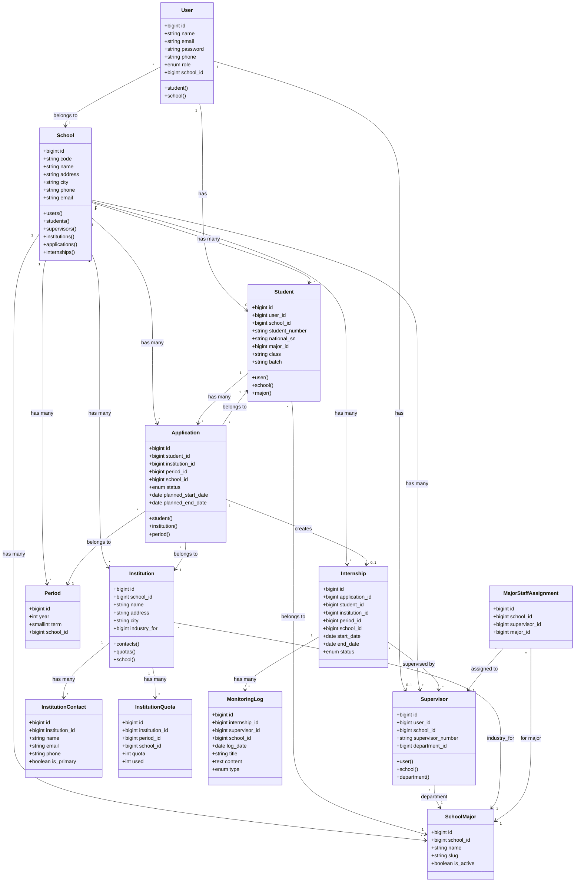
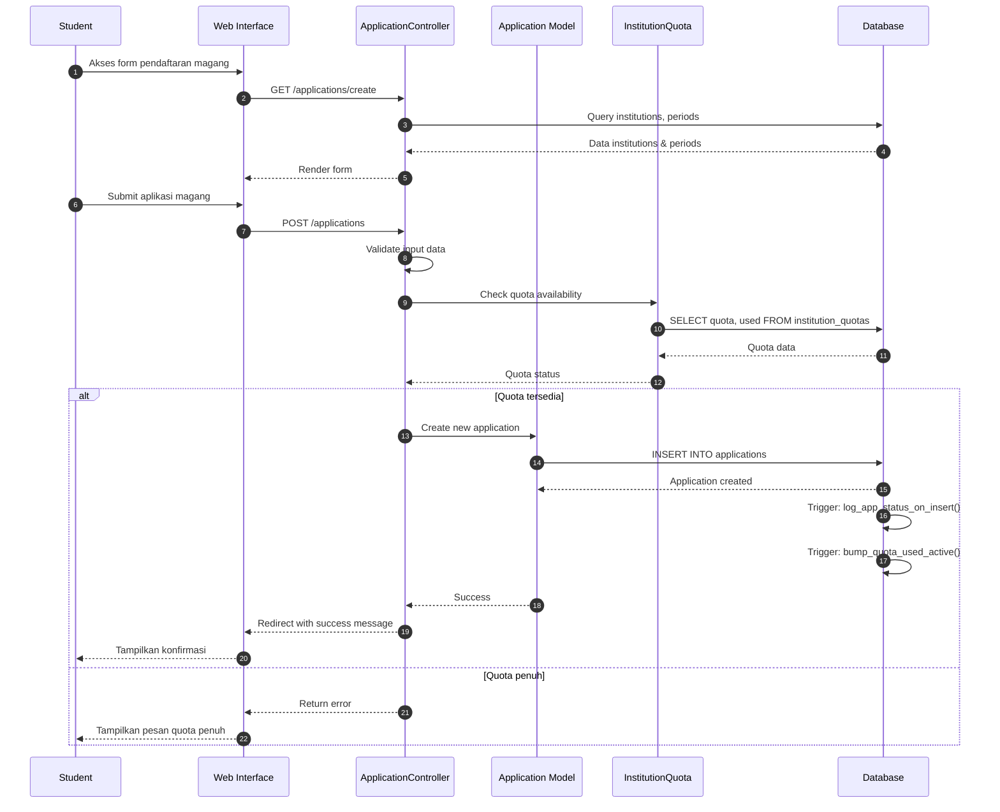
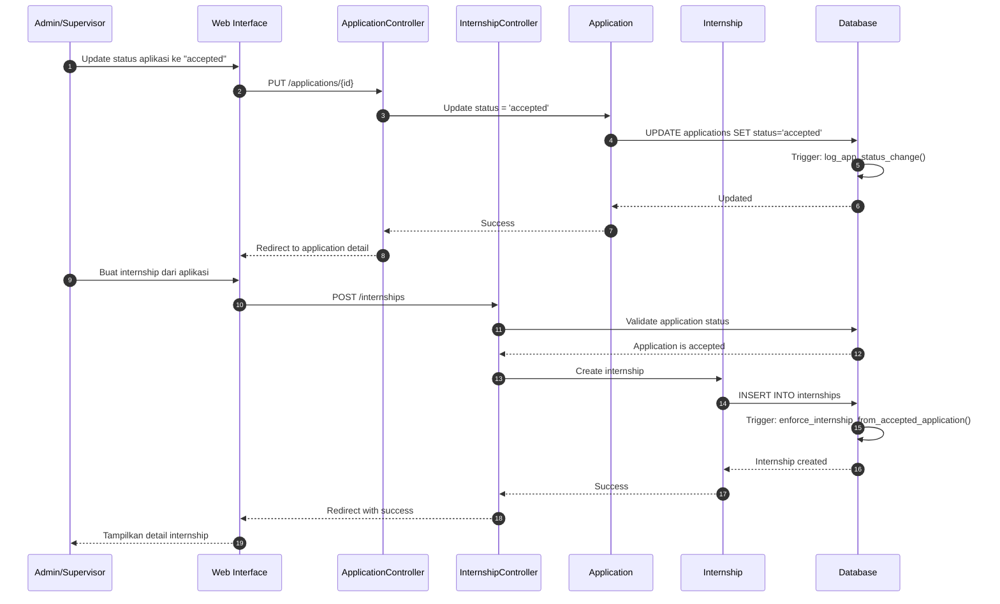
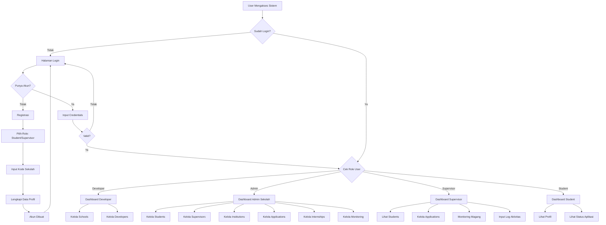
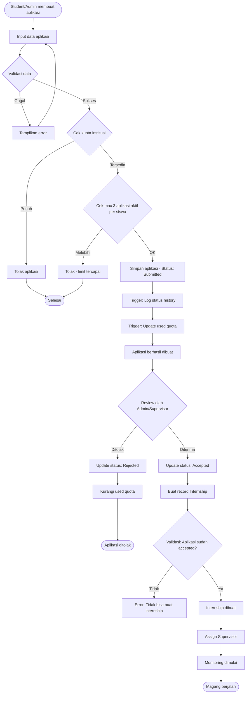
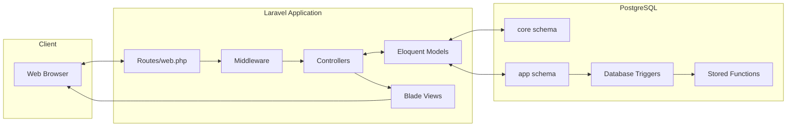

# **INTERNLINK**

> ⚠️ **DICARI MAINTAINER BARU** — Proyek ini mencari maintainer baru. Syarat: minimal 3 PR di-merge. Lihat [MAINTAINER_WANTED.md](MAINTAINER_WANTED.md)

## **Deskripsi Singkat**
Internlink adalah platform manajemen magang berbasis web yang dibangun menggunakan framework Laravel. Aplikasi ini bertujuan untuk menghubungkan dan memfasilitasi interaksi antara siswa, sekolah/institusi pendidikan, perusahaan, dan supervisor. Sistem ini mencakup fitur untuk pendaftaran magang, pemantauan (monitoring), autentikasi pengguna, serta manajemen peran untuk admin, staf, dan pengembang.

## **Arsitektur/Diagram Sistem**

### Class Diagram (Entity Relationship)



### Sequence Diagram - Proses Pendaftaran Magang



### Sequence Diagram - Alur Penerimaan & Internship



### Flowchart - Alur Utama Sistem



### Flowchart - Proses Aplikasi Magang



### Arsitektur Teknologi



## **Instalasi & Setup**

### Prasyarat

Pastikan sistem Anda sudah memiliki:
- **PHP 8.1+** dengan ekstensi: `pdo_pgsql`, `pgsql`, `mbstring`, `openssl`, `zip`, `fileinfo`, `xml`, `curl`
- **PostgreSQL 14+**
- **Node.js 18 LTS+** & npm
- **Composer**
- **Git**
- **Chrome/Chromium** (untuk fitur export PDF)

---

### Langkah Instalasi

#### 1. Clone Repository

```bash
git clone https://github.com/crbsdndr/internlink.git
cd internlink
```

#### 2. Install Dependensi

```bash
# Install dependensi PHP
composer install

# Install dependensi Node.js
npm install

# Build assets frontend
npm run build
```

#### 3. Konfigurasi Environment

```bash
# Salin file environment
cp .env.example .env    # Linux/Mac
copy .env.example .env  # Windows
```

Edit file `.env` dan sesuaikan konfigurasi database:
```env
APP_NAME=Internlink
APP_ENV=local
APP_DEBUG=true
APP_URL=http://127.0.0.1:8000

DB_CONNECTION=pgsql
DB_HOST=127.0.0.1
DB_PORT=5432
DB_DATABASE=internlink
DB_USERNAME=your_username
DB_PASSWORD=your_password
```

#### 4. Setup Database

Buat database di PostgreSQL:
```sql
CREATE DATABASE internlink;
```

Kemudian jalankan migrasi:
```bash
# Generate application key
php artisan key:generate

# Jalankan migrasi
php artisan migrate

# (Opsional) Isi data contoh
php artisan db:seed
```

#### 5. Jalankan Aplikasi

```bash
php artisan serve
```

✅ Akses aplikasi di: **http://127.0.0.1:8000**

---

### Development Mode (Hot Reload)

Jalankan dua terminal secara bersamaan:

```bash
# Terminal 1 - Laravel Server
php artisan serve

# Terminal 2 - Vite Dev Server
npm run dev
```

---

### Akun Default (Setelah Seeding)

| Role | Email | Password |
|------|-------|----------|
| Developer | `dev@internlink.test` | `password` |

> ⚠️ **Penting:** Ubah password default setelah login pertama kali!

## **Fitur/Fungsi Utama**

### 🔐 Autentikasi & Otorisasi

| Fitur | Deskripsi |
|-------|-----------|
| **Multi-step Registration** | Pendaftaran akun untuk Student dan Supervisor dengan verifikasi kode sekolah |
| **Session-based Login** | Autentikasi berbasis session dengan redirect otomatis ke realm sekolah |
| **Role-based Access Control** | 4 level akses: Developer, Admin, Supervisor, Student |
| **Password Management** | Ubah password dengan validasi old/new/confirm |

### 🏫 Manajemen Sekolah (Developer Only)

| Fitur | Route | Deskripsi |
|-------|-------|-----------|
| **CRUD Sekolah** | `/schools` | Kelola data sekolah (nama, alamat, kontak, kepala sekolah) |
| **Realm System** | `/{school_code}/...` | Setiap sekolah memiliki kode unik sebagai prefix URL |
| **Jurusan/Departemen** | `/{school}/settings/environments` | Kelola daftar jurusan aktif per sekolah |

### 👥 Manajemen Pengguna

| Modul | Route | Akses | Fitur |
|-------|-------|-------|-------|
| **Students** | `/{school}/students` | Admin, Supervisor | CRUD siswa dengan NIS, NISN, jurusan, kelas, angkatan |
| **Supervisors** | `/{school}/supervisors` | Admin, Developer | CRUD pembimbing dengan nomor pegawai dan departemen |
| **Admins** | `/{school}/admins` | Developer | Kelola admin sekolah |
| **Major Contacts** | `/{school}/major-contacts` | Admin, Developer | Mapping jurusan ke supervisor sebagai contact person |

### 🏢 Manajemen Institusi Mitra

| Fitur | Deskripsi |
|-------|-----------|
| **Data Institusi** | Nama, alamat, kota, provinsi, website, industri |
| **Kontak Institusi** | Multiple contacts dengan penanda primary |
| **Kuota per Periode** | Kuota magang per semester dengan tracking penggunaan |
| **Industry Mapping** | Mapping institusi ke jurusan yang relevan |

### 📝 Aplikasi Magang

| Fitur | Deskripsi |
|-------|-----------|
| **Pengajuan Individual** | Siswa mengajukan magang ke institusi pilihan |
| **Bulk Application** | Admin/Supervisor dapat mengajukan untuk banyak siswa sekaligus |
| **Auto Period Detection** | Periode otomatis terdeteksi dari tanggal mulai |
| **Quota Validation** | Sistem memblokir pengajuan jika kuota penuh |
| **Status Workflow** | `draft` → `submitted` → `under_review` → `accepted` / `rejected` / `cancelled` |
| **PDF Export** | Generate surat pengajuan magang dalam format PDF |
| **Print All** | Cetak semua aplikasi sekaligus |

### 🎓 Manajemen Internship

| Fitur | Deskripsi |
|-------|-----------|
| **Create from Application** | Internship dibuat dari aplikasi yang sudah `accepted` |
| **Status Tracking** | `planned` → `ongoing` → `completed` / `terminated` |
| **Supervisor Assignment** | Assign pembimbing untuk setiap internship |
| **Schedule Management** | Kelola tanggal mulai dan selesai magang |

### 📊 Monitoring & Logging

| Fitur | Deskripsi |
|-------|-----------|
| **Activity Logs** | Catat aktivitas harian/mingguan siswa magang |
| **Log Types** | `weekly`, `issue`, `final`, `other` |
| **Bulk Monitoring** | Terapkan log ke semua siswa di institusi yang sama |
| **Progress Tracking** | Pantau perkembangan magang secara real-time |

### ⚙️ Settings & Konfigurasi

| Menu | Route | Deskripsi |
|------|-------|-----------|
| **Profile** | `/{school}/settings/profile` | Edit data profil sesuai role |
| **Security** | `/{school}/settings/security` | Ubah password dengan validasi |
| **Environments** | `/{school}/settings/environments` | Kelola jurusan (Admin/Developer) |

### 🔧 Fitur Teknis

| Fitur | Teknologi |
|-------|-----------|
| **PDF Generation** | Browsershot + Chromium untuk render PDF |
| **Dynamic Dropdowns** | Tom Select untuk autocomplete dan multi-select |
| **Database Triggers** | PostgreSQL triggers untuk audit trail dan validasi |
| **Multi-tenant** | Path-based tenancy dengan middleware `school` |
| **CSRF Protection** | Semua form mutation dilindungi CSRF token |

## **Pemecahan Masalah / FAQ**

### ❓ Bagaimana cara menambahkan sekolah baru ke sistem?

Hanya user dengan role **Developer** yang dapat menambahkan sekolah baru.

1. Login sebagai Developer
2. Akses menu **Schools** (`/schools`)
3. Klik tombol **Tambah Sekolah**
4. Isi data sekolah (nama, alamat, kontak, kepala sekolah)
5. Sistem akan otomatis generate **kode sekolah** unik
6. Kode sekolah ini yang akan digunakan user lain saat registrasi

> 💡 **Tips:** Setelah sekolah dibuat, buat minimal 1 akun Admin untuk sekolah tersebut via menu **Admins** (`/{school_code}/admins`).

---

### ❓ Mengapa saya tidak bisa login setelah registrasi?

Beberapa kemungkinan penyebab:

| Masalah | Solusi |
|---------|--------|
| **Kode sekolah salah** | Pastikan kode sekolah yang diinput saat registrasi sudah benar (case-insensitive) |
| **Email sudah terdaftar** | Gunakan email lain atau hubungi admin sekolah |
| **Password salah** | Gunakan fitur reset password atau hubungi admin |
| **Session expired** | Clear cookies browser dan coba login ulang |

Jika masih bermasalah, minta admin/developer untuk mengecek status akun Anda di database.

---

### ❓ Bagaimana cara mengatur kuota magang untuk institusi?

Kuota magang diatur per **institusi** dan per **periode** (semester).

1. Login sebagai Admin atau Supervisor
2. Akses menu **Institutions** (`/{school}/institutions`)
3. Pilih institusi yang ingin diatur kuotanya
4. Pada halaman detail, cari bagian **Kuota per Periode**
5. Klik **Tambah Kuota** atau edit kuota existing
6. Isi:
   - **Periode**: Pilih tahun dan semester (misal: 2025 Semester 1)
   - **Kuota**: Jumlah maksimal siswa yang bisa magang
7. Simpan

> ⚠️ **Penting:** Sistem akan otomatis menolak aplikasi baru jika `used >= quota`. Pastikan kuota sudah diatur sebelum periode magang dimulai.

---

### ❓ Kenapa PDF surat pengajuan tidak bisa di-generate / hasilnya kosong?

Fitur PDF menggunakan **Browsershot** yang membutuhkan Chrome/Chromium terinstall di server.

**Checklist troubleshooting:**

| Langkah | Perintah/Aksi |
|---------|---------------|
| 1. Pastikan Chromium terinstall | `which chromium` atau `which google-chrome` |
| 2. Cek path di config | Lihat `config/browsershot.php` atau `.env` |
| 3. Cek permission | `chmod +x /usr/bin/chromium` |
| 4. Test manual | `php artisan tinker` lalu jalankan Browsershot test |
| 5. Cek error log | `tail -f storage/logs/laravel.log` |

**Untuk environment tanpa GUI (server):**
```bash
# Install dependencies untuk headless Chrome
sudo apt install -y libnss3 libatk1.0-0 libatk-bridge2.0-0 libcups2 libxcomposite1 libxrandr2 libxdamage1 libgbm1
```

**Set path di `.env` (jika perlu):**
```env
BROWSERSHOT_CHROME_PATH=/usr/bin/chromium
```

---

### ❓ Apa perbedaan role Admin, Supervisor, dan Student?

| Kemampuan | Developer | Admin | Supervisor | Student |
|-----------|:---------:|:-----:|:----------:|:-------:|
| Kelola Schools | ✅ | ❌ | ❌ | ❌ |
| Kelola Developers | ✅ | ❌ | ❌ | ❌ |
| Kelola Admins | ✅ | ❌ | ❌ | ❌ |
| Kelola Students | ✅ | ✅ | ✅ (view) | ❌ |
| Kelola Supervisors | ✅ | ✅ | ❌ | ❌ |
| Kelola Institutions | ✅ | ✅ | ✅ | ❌ |
| Kelola Applications | ✅ | ✅ | ✅ | 👁️ (view own) |
| Kelola Internships | ✅ | ✅ | ✅ | ❌ |
| Input Monitoring Log | ✅ | ✅ | ✅ | ❌ |
| Edit Profil Sendiri | ✅ | ✅ | ✅ | ✅ |
| Ubah Password | ✅ | ✅ | ✅ | ✅ |
| Kelola Jurusan | ✅ | ✅ | ❌ | ❌ |

**Ringkasan:**
- **Developer**: Super admin, akses penuh ke semua sekolah
- **Admin**: Mengelola semua aspek dalam 1 sekolah
- **Supervisor**: Pembimbing magang, fokus pada monitoring dan aplikasi
- **Student**: Hanya bisa melihat profil dan status aplikasi sendiri

## **Kontribusi**

### Cara Berkontribusi

1. Fork repository → Clone → Buat branch baru
2. Lakukan perubahan dengan format commit [Conventional Commits](https://www.conventionalcommits.org/)
3. Push → Buat Pull Request ke `main`

### Panduan Singkat

- **PHP**: PSR-12, jalankan `./vendor/bin/pint`
- **Testing**: `php artisan test`
- **Bug Report**: Buka issue di [GitHub Issues](https://github.com/crbsdndr/internlink/issues)

## **Informasi Kontak & Lisensi**

### Lisensi

**GNU General Public License v3.0** — Lihat [LICENSE](LICENSE)

### Kontak

| | |
|---|---|
| **Maintainer** | Dendra |
| **Email** | artrialazz@gmail.com.com |
| **Repository** | [github.com/crbsdndr/internlink](https://github.com/crbsdndr/internlink) |

### Acknowledgments

[Laravel](https://laravel.com/) • [PostgreSQL](https://www.postgresql.org/) • [Vite](https://vitejs.dev/) • [Bootstrap](https://getbootstrap.com/) • [Tom Select](https://tom-select.js.org/) • [Browsershot](https://github.com/spatie/browsershot)

---

<div align="center">

**Made with ❤️ for Indonesian Vocational Schools**

[⬆ Kembali ke Atas](#internlink)

</div>
